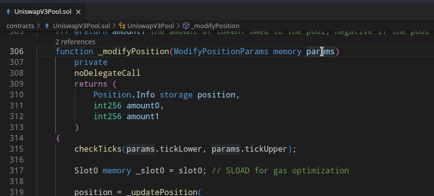
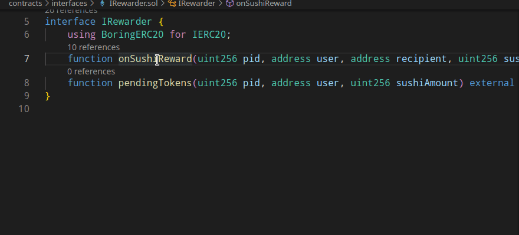
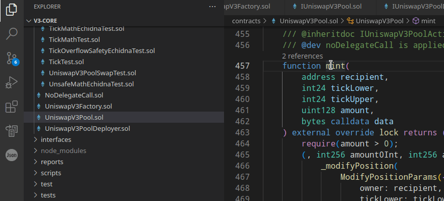
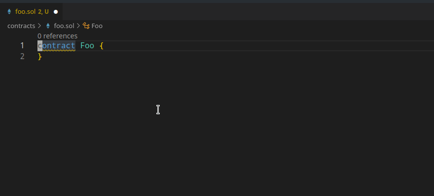
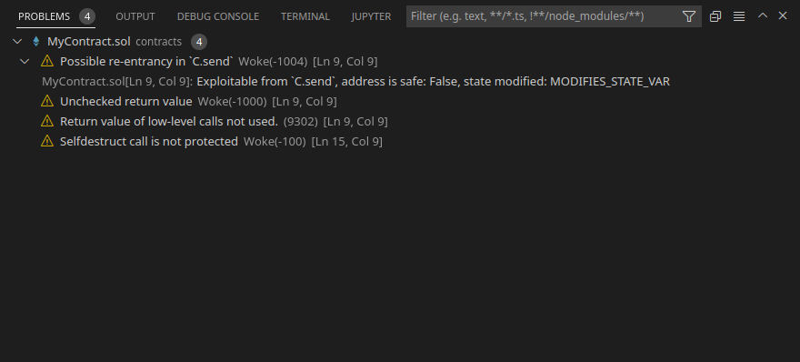

# Solidity LSP server
Woke implements an [LSP](https://microsoft.github.io/language-server-protocol/) server for Solidity. The only currently supported communication channel is TCP.

Woke LSP server can be run using:
```shell
woke lsp
```

Or with an optional `--port` argument:
```shell
woke lsp --port 1234
```

!!! info

    Multi-root workspaces are not currently supported.

## Projects using Woke LSP server
- VS Code Extension

## Configuration options
Server configuration options are loaded using the [standard interface](https://microsoft.github.io/language-server-protocol/specifications/lsp/3.17/specification/#workspace_configuration) from LSP clients. The process of setting the configuration options is client specific. Configuration changes are handled by the server, and the project is recompiled if the compilation options change.

The full list of supported configuration options can be found in the [configuration](configuration.md#configuration-options) section.

!!! warning
    Configuration options are not loaded from `woke.toml` files by the LSP server.

## Supported commands

Woke LSP server implements the command execution provider as specified by the [LSP specification](https://microsoft.github.io/language-server-protocol/specifications/lsp/3.17/specification/#workspace_executeCommand). The following commands are supported:

| Command                                                   | Arguments                                                                                                                                                                                  | Description                                                                                                                                     |
|:----------------------------------------------------------|:-------------------------------------------------------------------------------------------------------------------------------------------------------------------------------------------|:------------------------------------------------------------------------------------------------------------------------------------------------|
| <nobr>`woke.lsp.force_recompile`</nobr>                   |                                                                                                                                                                                            | Force recompile the opened project/files. Useful after modifying files outside the IDE (e.g. after installing npm packages).                    |
| <nobr>`woke.generate.control_flow_graph`</nobr>           | `0`: [URI](https://microsoft.github.io/language-server-protocol/specifications/lsp/3.17/specification/#uri) of the document containing the function<br>`1`: canonical name of the function | Generate a control flow graph for the given function or modifier. Returns the source code of the graph in Graphviz (DOT) format.                |
| <nobr>`woke.generate.inheritance_graph`</nobr>            |                                                                                                                                                                                            | Generate an inheritance graph for the whole project. A workspace must be opened. Returns the source code of the graph in Graphviz (DOT) format. |
| <nobr>`woke.generate.inheritance_graph`</nobr>            | `0`: [URI](https://microsoft.github.io/language-server-protocol/specifications/lsp/3.17/specification/#uri) of the document containing the contract<br>`1`: name of the contract           | Generate an inheritance graph for the given contract. Returns the source code of the graph in Graphviz (DOT) format.                            |
| <nobr>`woke.generate.linearized_inheritance_graph`</nobr> | `0`: [URI](https://microsoft.github.io/language-server-protocol/specifications/lsp/3.17/specification/#uri) of the document containing the contract<br>`1`: name of the contract           | Generate a linearized inheritance graph for the given contract. Returns the source code of the graph in Graphviz (DOT) format.                  |

## Features

### Go to definition


### Go to type definition



### Go to implementation

Finds implementations of an unimplemented function or modifier.



### Find references


### Type hierarchy


Also works for virtual functions.



### Document links


### Hover

Includes links to documentation for OpenZeppelin contracts.


### Code lens

Number of references is shown above each declaration.


### Document symbols


### Diagnostics




Together with compiler errors, diagnostics also include results from Woke vulnerability detectors.




### Rename


## Debugging

Woke LSP server can be debugged using:
```shell
woke --debug lsp
```