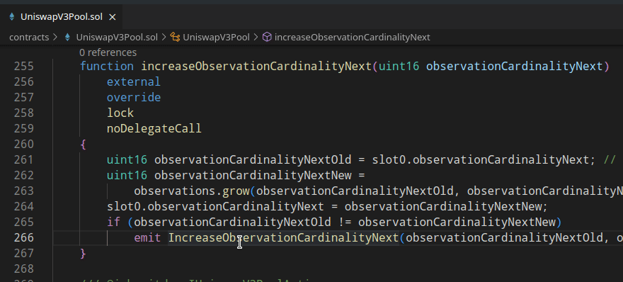
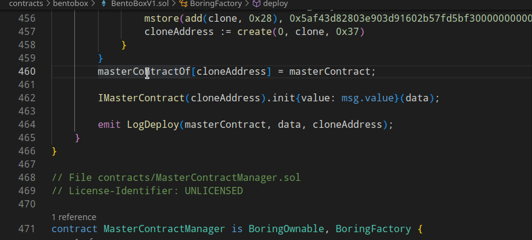
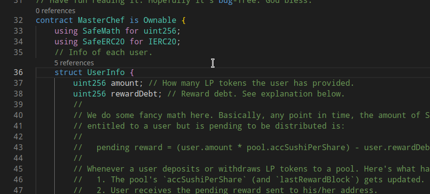
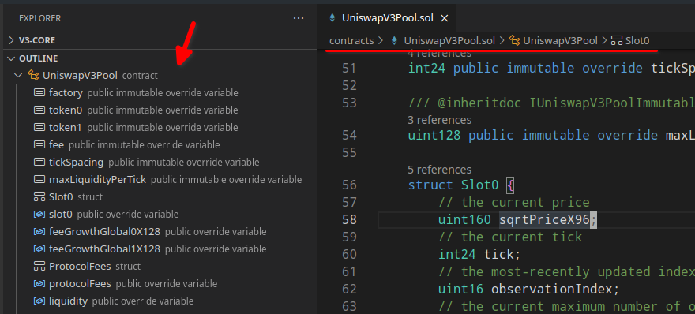
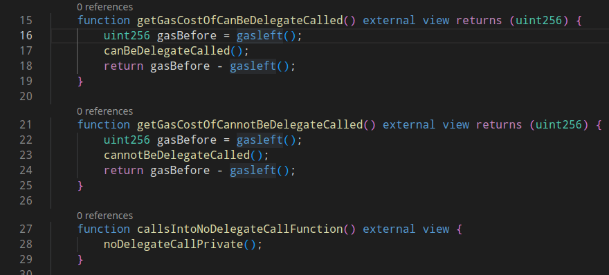

# Solidity LSP server
Woke implements a [LSP](https://microsoft.github.io/language-server-protocol/) server for Solidity. The only currently supported communication channel is TCP.

Woke LSP server can be run using:
```shell
woke lsp
```

Or with an optional `--port` argument:
```shell
woke lsp --port 1234
```

!!! info

    Multi-root workspaces are not currently supported.

## Projects using Woke server
- VS Code Extension

## Configuration options
Server configuration options are loaded using the [standard interface](https://microsoft.github.io/language-server-protocol/specifications/lsp/3.17/specification/#workspace_configuration) from LSP clients. The process of setting the configuration options is client specific. Configuration changes are handled by the server, and the project is recompiled if the compilation options change.

The following configuration options are supported:

- `woke.compiler.solc.allow_paths`,
- `woke.compiler.solc.evm_version`,
- `woke.compiler.solc.ignore_paths`,
- `woke.compiler.solc.include_paths`,
- `woke.compiler.solc.remappings`,
- `woke.compiler.solc.target_version`,
- `woke.compiler.solc.via_IR`,
- `woke.compiler.solc.optimizer.enabled`,
- `woke.compiler.solc.optimizer.runs`,
- `woke.lsp.find_references.include_declarations`.

The semantics of these configuration options are explained in the [configuration section](configuration.md#compilersolc-namespace).

## Supported commands

Woke LSP server implements the command execution provider as specified by the [LSP specification](https://microsoft.github.io/language-server-protocol/specifications/lsp/3.17/specification/#workspace_executeCommand). The following commands are supported:

| Command                                 | Description                                                                                                                  |
|:----------------------------------------|:-----------------------------------------------------------------------------------------------------------------------------|
| <nobr>`woke.lsp.force_recompile`</nobr> | Force recompile the opened project/files. Useful after modifying files outside the IDE (e.g. after installing npm packages). |

## Features

### Go to definition



### Go to type definition


### Go to implementation

Find implementations of an unimplemented function or modifier.


### Find references



### Type hierarchy


Also works for virtual functions.


### Document links


### Hover

Includes links to documentation for OpenZeppelin contracts.



### Code lens

Number of references is shown above each declaration.


### Document symbols



### Diagnostics


### Rename



## Debugging

Woke LSP server can be debugged using:
```shell
woke --debug lsp
```