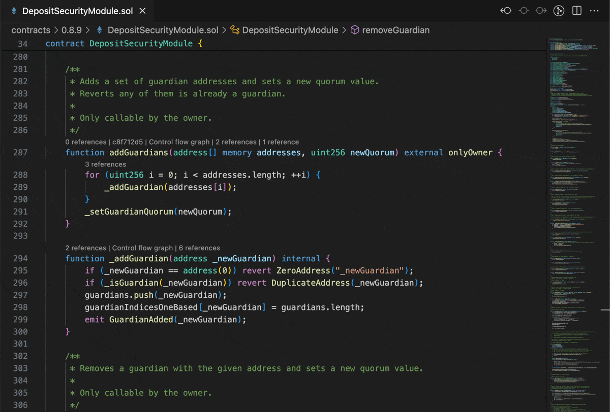

# LSP control flow graph

Name: `lsp-control-flow-graph`

Generates a control flow graph of a function or modifier by clicking on the code lens using the Language Server Protocol.

## Example

## Parameters

| TOML name   | Type                             | Default value | Description                                   |
|-------------|----------------------------------|---------------|-----------------------------------------------|
| `direction` | Choice of `TB`, `BT`, `LR`, `RL` | `TB`          | Direction of the graph.                       |
| `urls`      | `bool`                           | `true`        | Whether to generate links to the source code. |
