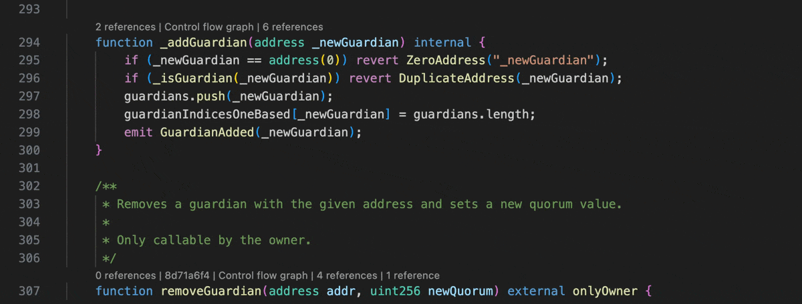

# LSP references

Name: `lsp-references`

Shows the number of references to a declaration using the Language Server Protocol code lens.
Clicking on the code lens shows the references in the editor.

## Example

## Parameters

| TOML name                           | Type   | Default value | Description                                                 |
|-------------------------------------|--------|---------------|-------------------------------------------------------------|
| <nobr>`include_declarations`</nobr> | `bool` | `false`       | Whether to include the declaration in the references.       |
| <nobr>`local_variables`</nobr>      | `bool` | `true`        | Whether to show references of local variables.              |
| <nobr>`parameter_variables`</nobr>  | `bool` | `true`        | Whether to show references of variables in parameter lists. |
