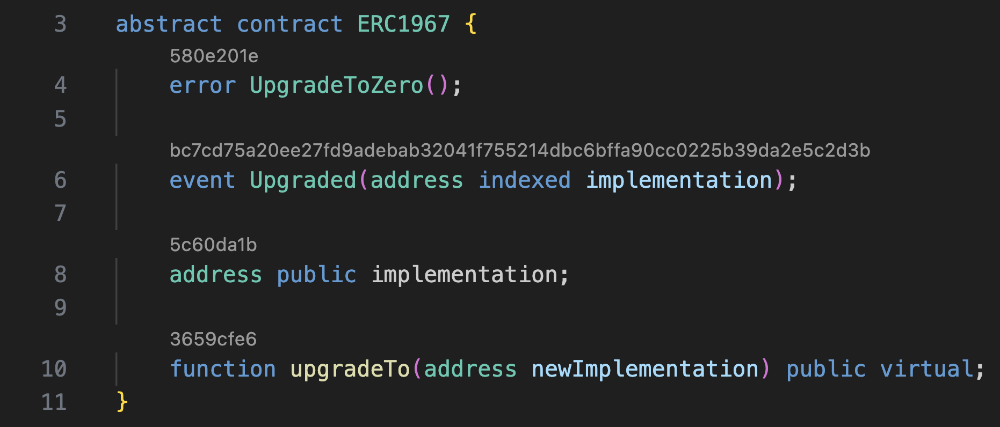

# LSP selectors

Name: `lsp-selectors`

Shows selectors of functions, public state variables, events, and errors using the Language Server Protocol code lens.
Clicking on the code lens copies the selector to the clipboard.

## Example

## Parameters

| TOML name   | Type   | Default value | Description                                   |
|-------------|--------|---------------|-----------------------------------------------|
| `functions` | `bool` | `true`        | Whether to show selectors of functions.       |
| `variables` | `bool` | `true`        | Whether to show selectors of state variables. |
| `events`    | `bool` | `true`        | Whether to show selectors of events.          |
| `errors`    | `bool` | `true`        | Whether to show selectors of errors.          |
