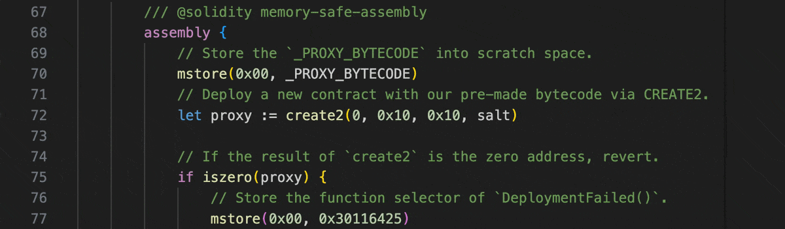

# LSP Yul definitions

Name: `lsp-yul-definitions`

Shows definitions of built-in Yul functions through the Language Server Protocol hover.

## Example

## Parameters

The printer does not accept any additional parameters.
