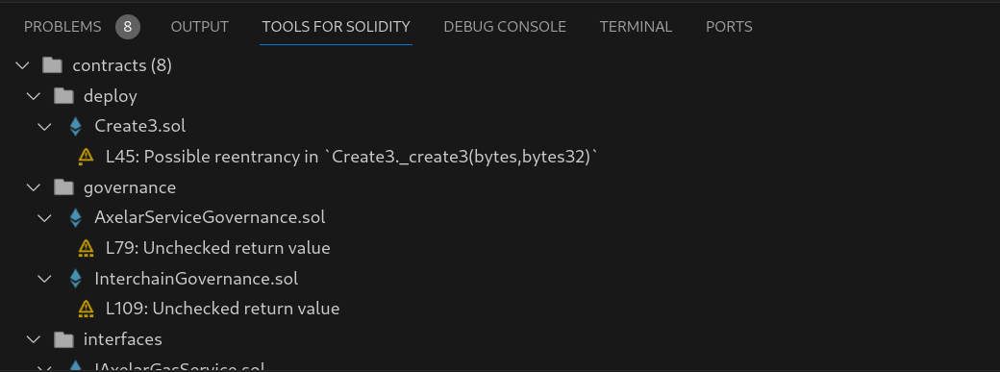

# Using detectors

Wake comes with the built-in [wake_detectors](https://github.com/Ackee-Blockchain/wake/tree/main/wake_detectors) module, which provides a set of detectors for common vulnerabilities and code quality issues in Solidity smart contracts.

<div id="detect-asciinema" style="z-index: 1; position: relative;"></div>
<script>
  window.onload = function(){
    AsciinemaPlayer.create('../detect.cast', document.getElementById('detect-asciinema'), { preload: true, autoPlay: true, rows: 28 });
}
</script>

The first label in each detection message describes the impact of the issue, the second label describes the confidence of the detection.

## Basic usage

To list all available detectors, run:

```bash
wake detect --help
```

Use

```bash
wake detect all
```

to run all detectors on all contracts in the project or

```bash
wake detect detector-name
```

to run a specific detector only.

In both cases, it is possible to specify paths to contracts to be analyzed, `--min-impact` and `--min-confidence`:

```bash
wake detect all contracts/utils --min-impact medium --min-confidence high
```

!!! tip
    The [Tools for Solidity](https://marketplace.visualstudio.com/items?itemName=AckeeBlockchain.tools-for-solidity) VS Code extension comes with a custom UI for viewing and filtering detector results and compiler warnings and errors.

    

## Ignoring detections

Reported detections may be ignored by adding a comment to the detection location in the source code. Both single-line (`// ...`) and multi-line (`/* ... */`) comments are supported.

There are 4 types of comments:

- `// wake-disable-line` disables detections on the current line,
- `// wake-disable-next-line` disables detections on the next line,
- `// wake-disable` disables detections on the current line and all following lines,
- `// wake-enable` re-enables detections after `// wake-disable`.

All comments may be followed by a list of detector names and compiler warning codes separated by commas. Whitespace is ignored.
For example:

```solidity
// wake-disable unused-import, unused-contract, 1234
```

Compiler errors cannot be ignored. If no detector names or compiler warning codes are specified, all detections are ignored (or re-enabled in case of `// wake-enable`).


## Detector configuration

Detectors may accept additional arguments and options. To list them, run:

```bash
wake detect detector-name --help
```

The output also describes environment variables that can be used to configure given arguments and options.

Additionally, detector configuration can be specified in the project-specific and global configuration TOML file, for example:

```toml title="wake.toml"
[detector."detector-name"]
min_impact = "medium"
min_confidence = "high"
custom_option = "value"
```

See [Configuration](../configuration.md) for more information.

## Changing detector loading priorities

Detectors may be loaded from local directories:

- `./detectors` (project-specific)
- `$XDG_DATA_HOME/wake/global-detectors` (global)

and from detector packages (plugins), for example `wake_detectors`.

A detector of the same name may be present in multiple packages (plugins). To see the list of available sources for each detector, run:

```bash
wake detect list
```

Project-specific and global detectors take precedence over detectors from packages, with project-specific detectors having the highest priority.

After that, detectors are loaded from packages in the alphabetical order of package module names, making the first package the lowest priority.

The loading priorities can be changed in the global `plugins.toml` configuration file.
See [Configuration](../configuration.md#global-configuration-file) for more information.

