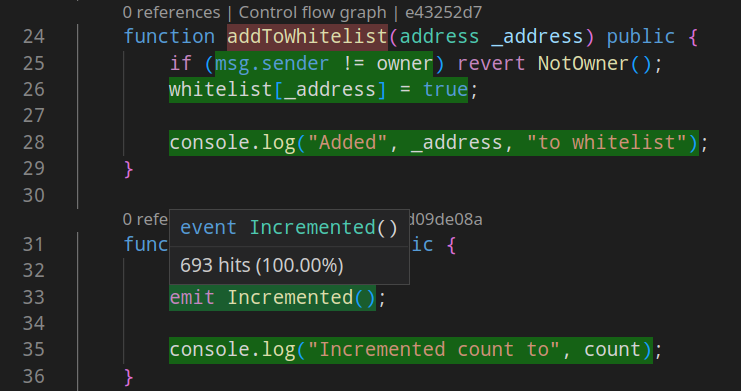

# Coverage analysis

Wake supports code coverage analysis of both Python test scripts and Solidity contracts.

## Python scripts coverage

In order to measure coverage of Python scripts executed using `wake test`, the [`pytest-cov`](https://pytest-cov.readthedocs.io/en/latest/) plugin can be used.

```bash
pip3 install pytest-cov
```

To analyze scripts located in the `tests` directory, run:

```console
$ wake test -- --cov=tests

---------- coverage: platform linux, python 3.7.12-final-0 -----------
Name                                 Stmts   Miss  Cover
--------------------------------------------------------
tests/__init__.py                        0      0   100%
tests/test_counter.py                   36      4    89%
tests/test_counter_fuzz.py              34      0   100%
tests/test_counter_fuzz_failing.py      23      4    83%
tests/test_crosschain.py                63      0   100%
--------------------------------------------------------
TOTAL                                  156      8    95%
```

Note that the `--` is required to separate the arguments passed to `wake` from the arguments passed to `pytest`.

## Solidity contracts coverage

Wake comes with a built-in coverage analysis module that can be activated by passing the `--coverage` flag to the `wake test` command.
It can be followed by an optional number of processes to collect coverage data from.

```bash
wake test --coverage
```

By passing the `--coverage` flag to `wake test` without specifying the number of processes, the coverage analysis is performed for all testing processes.
```base
wake test -P 4 --coverage 2
```

There are some limitations to this coverage analysis:

- code coverage can be inaccurate when analyzing a project with the solc optimizer enabled,
- multiple executions of the same function in the same transaction/call are counted as a single execution,
- `call` requests (default for `pure` and `view` functions) are not included in the coverage analysis with Ganache and Hardhat,
- code coverage introduces a significant overhead in the execution time of the tests.

By enabling the coverage collection, a `wake-coverage.cov` file is generated in the current directory.
To analyze this file, install [Tools for Solidity](https://marketplace.visualstudio.com/items?itemName=AckeeBlockchain.tools-for-solidity), a VS Code extension that can be used to visualize the coverage of Solidity contracts directly in the editor.
With the extension installed, execute the `Tools for Solidity: Show Coverage` command to open the coverage report.



The coverage report is updated automatically when the `wake-coverage.cov` file is modified.
To hide the coverage report, execute the `Tools for Solidity: Hide Coverage` command.

!!! warning
    Contents of Solidity source files must not be modified since the last generation of `pytypes`, otherwise the coverage highlighting may be rendered incorrectly.